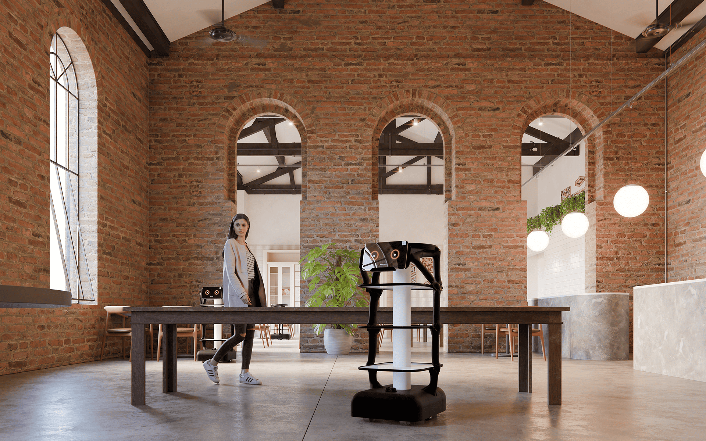
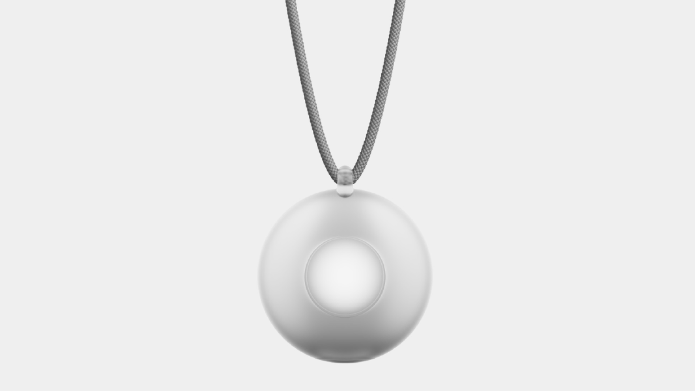
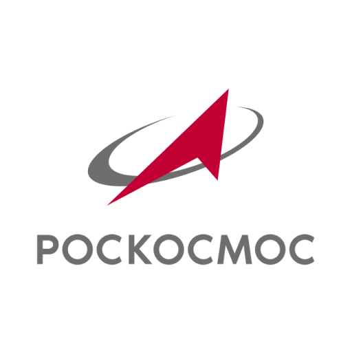
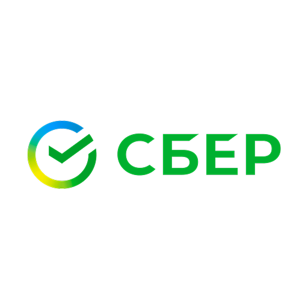
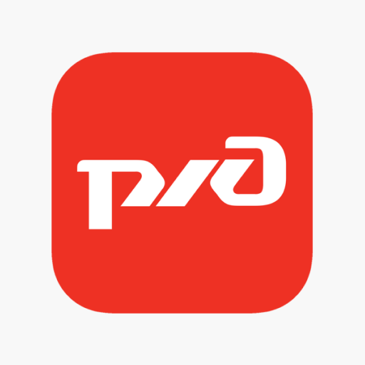
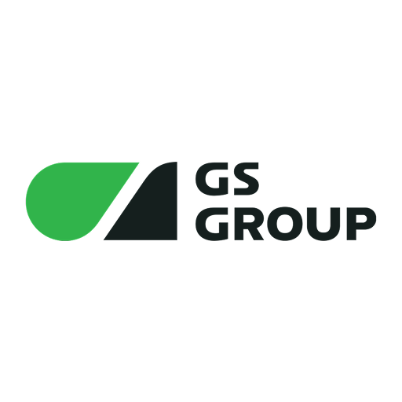
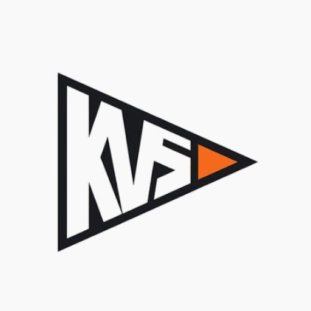
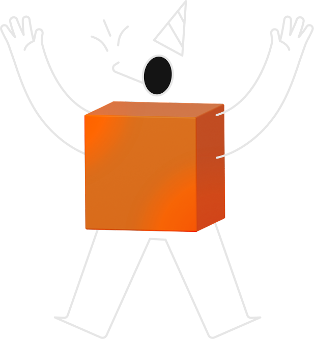

 

  

<h1 align="center">Михаил Шафиев</h1>

Владелец <strong>ГК «РОСАЙТИ»</strong>, двукратный чемпион России, ментор, преподаватель

  
  

### Наши проекты

  
  <h4>Роботы Milabot</h4>
  
Проектируем и разрабатываем автономных роботов для различных задач бизнеса

  
<strong>Технологии:</strong> Rust, Python, ROS, CV

  
  <h4>Миишка</h4>
  
Делаем игрушку с искусственным интеллектом, которая умеет общаться с ребенком, отвечать на его вопросы, обучать и играть

  
<strong>Технологии:</strong> Rust, Python, GO, LLM, TTS, STT

  
  <h4>Lumi</h4>
  
Делаем говорящие кулоны с искусственным интеллектом

  
<strong>Технологии:</strong> Rust, GO, LLM, TTS, STT

### Наши клиенты

  <h3>Разработка для крупнейших компаний России</h3>
  
Мы создаем инновационные решения и продукты для ведущих компаний страны, помогая им внедрять передовые технологии в области робототехники и искусственного интеллекта

  
  

    
    
    
    
    
  

  
  
  

    <a href="https://gkrosit.com" style="color: #785AFF; text-decoration: none;">Узнать больше на gkrosit.com</a>
  

  

  

 
 

  

